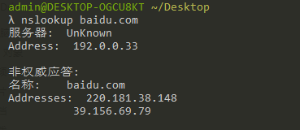
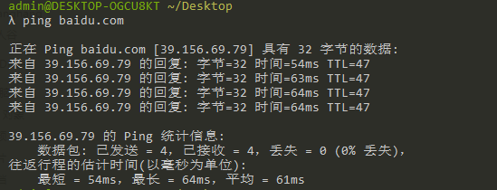

# 浅析URL
URL 包含哪几部分，每部分分别有什么作用；
DNS 的作用是什么，nslookup 命令怎么用；
IP 的作用是什么，ping 命令怎么用；
域名是什么，分别哪几类域名。
## 什么是URL
URL指的是统一资源定位符（Uniform Resource Locator）。URL就是一个给定的独特资源在Web上的地址。理论上说，每个有效的URL都指向一个独特的资源。这个资源可以是一个HTML页面，一个CSS文档，一幅图像，等等。而在实际中，有一些例外，最常见的情况就是URL指向了不存在的或是被移动过的资源。

    http://www.example.com:80/path/to/myfile.html?key1=value1&key2=value2#SomewhereInTheDocument

* http://  是协议。它表明了浏览器必须使用何种协议。它通常都是HTTP协议或是HTTP协议的安全版，即HTTPS。
* www.example.com  是域名。 它表明正在请求哪个Web服务器。或者，可以直接使用IP address, 但是因为它不太方便，所以它不经常在网络上使用。
* :80 是端口。 它表示用于访问Web服务器上的资源的技术“门”。如果Web服务器使用HTTP协议的标准端口（HTTP为80，HTTPS为443）来授予其资源的访问权限，则通常会被忽略。否则是强制性的。
* /path/to/myfile.html 是网络服务器上资源的路径。在Web的早期阶段，像这样的路径表示Web服务器上的物理文件位置。如今，它主要是由没有任何物理现实的Web服务器处理的抽象。
* ?key1=value1&key2=value2 是提供给网络服务器的额外参数。 这些参数是用 & 符号分隔的键/值对列表。在返回资源之前，Web服务器可以使用这些参数来执行额外的操作。每个Web服务器都有自己关于参数的规则，唯一可靠的方式来知道特定Web服务器是否处理参数是通过询问Web服务器所有者。
* #SomewhereInTheDocument 是资源本身的另一部分的锚点。锚点表示资源中的一种“书签”，给浏览器显示位于该“加书签”位置的内容的方向。例如，在HTML文档上，浏览器将滚动到定义锚点的位置;在视频或音频文档上，浏览器将尝试转到锚代表的时间。值得注意的是，＃后面的部分（也称为片段标识符）从来没有发送到请求的服务器。
  
    因此 URL=协议+域名+路径+查询参数+锚点

## DNS

域名系统（英语：Domain Name System，缩写：DNS）是互联网的一项服务。它作为将域名和IP地址相互映射的一个分布式数据库，能够使人更方便地访问互联网。

#### 举一个例子

zh.wikipedia.org 作为一个域名就和IP地址198.35.26.96 相对应。DNS就像是一个自动的电话号码簿，我们可以直接拨打198.35.26.96 的名字zh.wikipedia.org 来代替电话号码（IP地址）。DNS在我们直接调用网站的名字以后就会将像zh.wikipedia.org 一样便于人类使用的名字转化成像198.35.26.96 一样便于机器识别的IP地址。

DNS查询有两种方式：递归和迭代。DNS客户端设置使用的DNS服务器一般都是递归服务器，它负责全权处理客户端的DNS查询请求，直到返回最终结果。而DNS服务器之间一般采用迭代查询方式。

以查询 zh.wikipedia.org 为例：

1. 客户端发送查询报文"query zh.wikipedia.org"至DNS服务器，DNS服务器首先检查自身缓存，如果存在记录则直接返回结果。
2. 如果记录老化或不存在，则：
   * DNS服务器向根域名服务器发送查询报文"query zh.wikipedia.org"，根域名服务器返回顶级域 .org 的权威域名服务器地址。
   * DNS服务器向 .org 域的权威域名服务器发送查询报文"query zh.wikipedia.org"，得到二级域 .wikipedia.org 的权威域名服务器地址。
   * DNS服务器向 .wikipedia.org 域的权威域名服务器发送查询报文"query zh.wikipedia.org"，得到主机 zh 的A记录，存入自身缓存并返回给客户端

#### nslookup命令
如下面图片所示：

$ nslookup 域名——就可以查询对应域名的IP地址（Address）了。baidu.com对应的IP地址就有220.181.38.148和39.156.69.79两个。

## IP
IP全程Internet Protocol，用于定位每台设备和封装数据的。

$ http-server -c-1 即可查询自己IP，几个特殊IP。
* 127.0.0.1表示自己
* localhost通过host制定自己
* 0.0.0.0不表示任何设备
  
在C盘-windows-system32-drivers-etc-hosts文档里面可添加如"127.0.0.1 zhang"指定zhang为自己本地IP。
#### ping命令

ping命令则是查看自己电脑输入域名后对应的相应IP是哪一个。一个域名可对应多个IP，为了让机器负载均衡。

## 域名
域名（Domain names）是互联网基础架构的关键部分。它们为互联网上任何可用的网页服务器提供了人类可读的地址。

任何连上互联网的电脑都可以通过一个公共IP地址访问到，对于IPv4来说，这个地址由32位组成（它们通常写成四个范围在0~255以内，由点分隔的数字组成，比如173.194.121.32），而对于IPv6来说，这个地址由128位组成，通常写成八组由冒号分隔的四个十六进制数(e.g., 2027:0da8:8b73:0000:0000:8a2e:0370:1337). 计算机可以很容易地处理这些IP地址, 但是对一个人来说很难找出谁在操控这些服务器以及这些网站提供什么服务。IP 地址很难记忆而且可能会随着时间的推移发生改变 。为了解决这些问题，我们使用人类可读的地址，称作域名。
#### 域名结构
一个域名是由几部分（有可能只是一部分，也许是两部分，三部分...）组成的简单结构，它被点分隔，并需要从右到左阅读。

如www.baidu.com
* .com/.org/.net等 是顶级域名。顶级域名提供了最多的信息，它告诉用户通用服务背后的域名。
* baidu.com 是二级域名。baidu是标签，标签也可以是一串数字。
* www.baidu.com 是三级域名。一个域名可以有多个标签，如www.zhang.baidu.com都是可以的。

